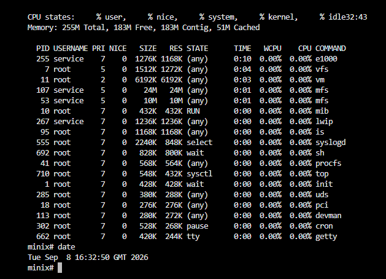

# minix3x
Experimental continuation and customization of MINIX.



## Building the system

Build the whole system (toolchain + release) using the `build.sh` script, e.g. for i386:

```bash
./build.sh -j $(nproc) -m i386 -O ../obj.i386 -D ../obj.i386/destdir.i386 -U -u release
```

## Creating a disk image

After a successful `make release`, generate a bootable disk image using the
`releasetools/x86_hdimage.sh` script (run it from the repository root):

```bash
ARCH=i386 OBJ=../obj.i386 releasetools/x86_hdimage.sh
```

The result is a `minix_x86.img` file in the repository root.

## Creating a bootable CD image

After a successful release build, generate a bootable ISO image using the
`releasetools/x86_cdimage.sh` script from the repository root:

```bash
ARCH=i386 OBJ=../obj.i386 releasetools/x86_cdimage.sh
```

The result is a `minix_x86.iso` file in the repository root. The script creates
a bootable i386 ISO with the MINIX kernel, boot modules, and CD boot menu.

## Running the CD image in QEMU

```bash
qemu-system-i386 -m 256 -cdrom minix_x86.iso
```

For a terminal-only display, use:

```bash
qemu-system-i386 -m 256 -cdrom minix_x86.iso -display curses
```

If KVM is available, add `--enable-kvm` to speed up emulation.

## Running the CD image in Hyper-V

The ISO uses legacy BIOS booting, so create a **Generation 1** virtual
machine. Generation 2 machines use UEFI and are not supported by this image.

1. Create a new Hyper-V virtual machine and select **Generation 1**.
2. Allocate at least 256 MB of memory.
3. In the virtual machine settings, open the IDE Controller's DVD Drive.
4. Select **Image file** and attach `minix_x86.iso`.
5. Set the DVD drive before the hard disk in the boot order, then start the VM.

The MINIX boot menu should appear after the VM starts.

## Running the image in QEMU

```bash
qemu-system-i386 -m 256 -drive file=minix_x86.img,format=raw,if=ide -display curses
```

Notes:
- `-display curses` renders the emulated screen as text in the current
  terminal and is useful in environments without X11/GTK (e.g. an SSH session
  or a VM without a GUI). If a graphical environment is available, you can
  drop this option or use `-display gtk`/`-display sdl` instead.
- If KVM is available (native Linux, or a VM with nested virtualization
  enabled), add `--enable-kvm` to speed up emulation.
- Only one QEMU instance can have the image file open at a time — a
  `Failed to get "write" lock` error means another QEMU process is already
  using it.
